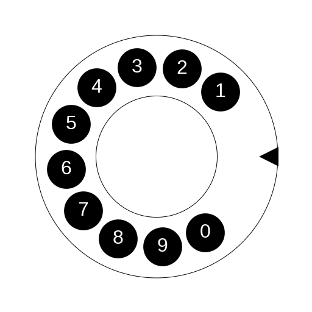

# Rotary Dial

A [Rotary Dial](https://en.wikipedia.org/wiki/Rotary_dial) for input numbers.



Live version [here](https://victorribeiro.com/dial) | Alternative link [here](https://victorqribeiro.github.io/dial/index.html)

# How to use it

Click / Touch the disc and drag it until the arrow. When the number reaches the arrow, it will turn red, then let go and that's your number.

# How to use it on your web app

Include the RotaryDial.js file.

```javascript
<script src="RotaryDial.js"></script>
```

Then create a new RotaryDial

```javascript
const rd = new RotaryDial();
```

Creating a callback is easy, just define what your function will do with the number it recieves from the RotaryDial.

```javascript
const fucn = function(number){
	alert( number )
}

const rd = new RotaryDial({callback: func});

```

By default the RotaryDial has the console.log fucntion as the callback.

# Documentation

The RotaryDial accepts a configuration object on it's constructor. The most import parts are the size and the callback. The size will determine the size of your rotary dial menu, and the callback detemines which fucntion will be called when a number is selected. Besides that, there are some color cofigurations you can fiddle with.

**size** - The size of the menu. *Default 400px*

**callback** - The function that will be called when a number is selected. *Default console.log*

**discFillColor** - The disc color.

**discStrokeColor** - The disc border color.

**circlesFillColor** - The circles (where the numbers are displayed) color.

**circlesStrokeColor** - The circles (where the numbers are displayed) border color.

**circlesHighlightColor** - The color that a circle will be displayed when a number is selected.

**textFillColor** - The text color.

**textStrokeColor** - The text border color.

**arrowFillColor** - The arrow color.

**arrowStrokeColor** - The arrow border color.
